# Smart Home Project

## Integrantes
- Osmar Israel Villegas Martinez 
- Jose Armando Gutierrez Rodriguez
- Victor Andres Garay Montes

## Visión
El objetivo del proyecto es desarrollar un producto de calidad capaz de monitorear el ambiente. El proyecto está pensado especialmente para aquellas personas que buscan obtener información relevante sobre el entorno a través de una aplicación y desean influir en él. Para cumplir con este propósito, el dispositivo implementa tecnologías para la recolección y análisis de datos, proporcionando así la información al usuario final.

## Objetivo general
Diseñar y desarrollar un sistema de IoT (Internet de las cosas) que permita monitorear y controlar el ambiente de una habitación con el fin de gestionar el entorno del usuario. El sistema debe monitorizar y, en caso necesario, mejorar las condiciones del ambiente para garantizar un entorno de calidad.

### Objetivos específicos
Implementar un sistema de análisis del ambiente que monitoree condiciones como luz, temperatura, Metano en el ambiente, clima, hora y número de pasos. Basado en los resultados, el sistema almacena la información para su posterior análisis y permite la activación de mecanismos como un ventilador o música.

## Arquitectura
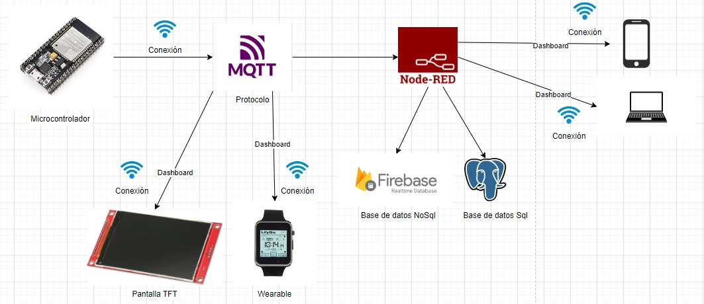

## Librerias Utilizadas
- Pin

- Sleep

- SoftwareSerial

- DFRobotDFPlayerMini

- Wire

- LiquidCrystal_I2C

- WiFi

- PubSubClient

- I2C (Inter-Integrated Circuit)

- ssd1306.py

## Tabla de Software utilizado
| Id | Software | Version | Tipo |
|----|----------|---------|------|
| 1 |  Postgresql  | 15.1.0 | SQL |
| 2 | Thonny  | 4.1.4 |  IDE |
| 3 | Node-Red | 3.2.9 | MQTT |
| 4 | supabase | 1.24.07 | NoSQL |
| 5 | Arduino IDE | 1.8.19 | IDE |
| 6 | Flutter | 3.24.1 | Framework |

## Tabla con el hardware utilizado (El costo de cada componente es al dia de 2 de junio del 2024)
| Id | Componente | Descripción | Imagen | Cantidad | Costo total |
|----|------------|-------------|--------|----------|-------------|
|1|Sensor de temperatura DHT22|Sensor para medir la temperatura del ambiente. ||1|$17,04 MXN|
|2|Sensor de gas MQ-9| Sensor para medir concentraciones de Metáno (CH4) y Gas Licuado de Petróleo (GLP).||$47.00 MXN|   
|3|Fotorresistencia|Sensor capaz de medir la oscuridad del ambiente.|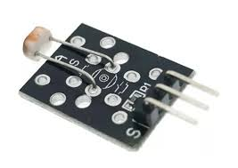|2|$13,97 MXN|
|4|DFPlayer-Mini Módulo|Modulo DFPlayer permite la reproducción de audios grabados en una memoria sd.|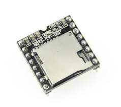|1|$26,46 MXN|
|5|Bocina|Bocina para reproducir musica utilizando el modulo DFPlayer-mini.|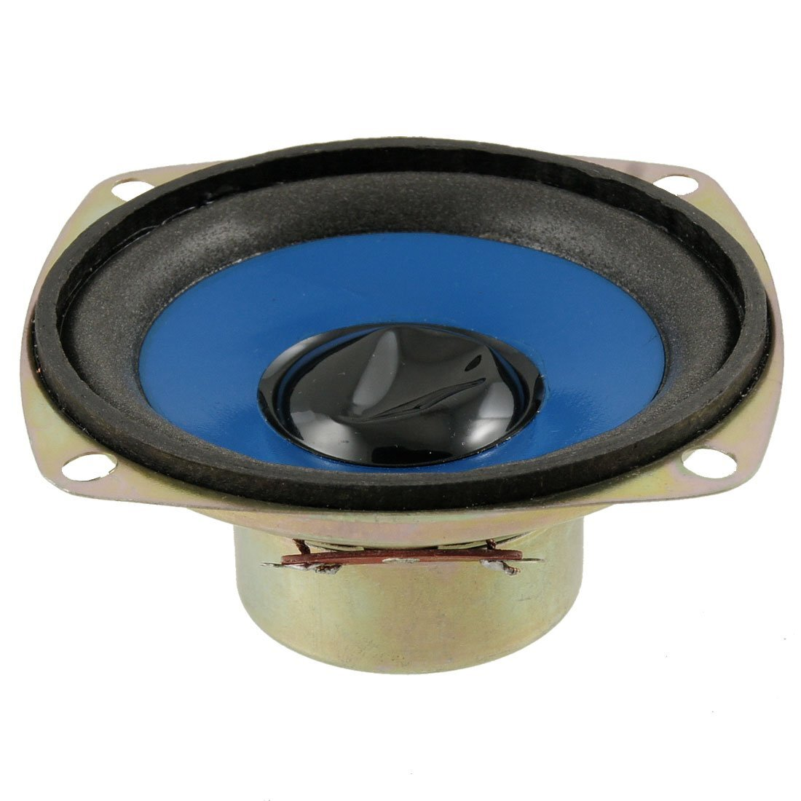|1|$0,00 MXN|
|6|Tarjeta SD|Tarjeta SD para reproducir musica utilizando el modulo DFPlayer-mini.||1|$150,00 MXN|
|7|ESP32|ESP32 es la denominación de una familia de chips SoC de bajo coste y consumo de energía, con tecnología Wi-Fi y Bluetooth de modo dual integrada.||2|$250,00 MXN|
|8|Pantalla (Weareble)|Reloj inteligente ESP32, dispositivo programable con WIFI, Bluetooth, papel electrónico, Hardware y Software de código abierto|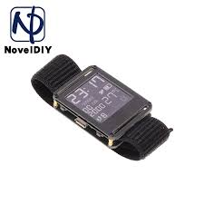|1|$356,64 MXN|
|9|Relevador 5V KY-019| El Relevador 5V KY-019 es un dispositivo electrónico que permite controlar dispositivos por medio de un puente|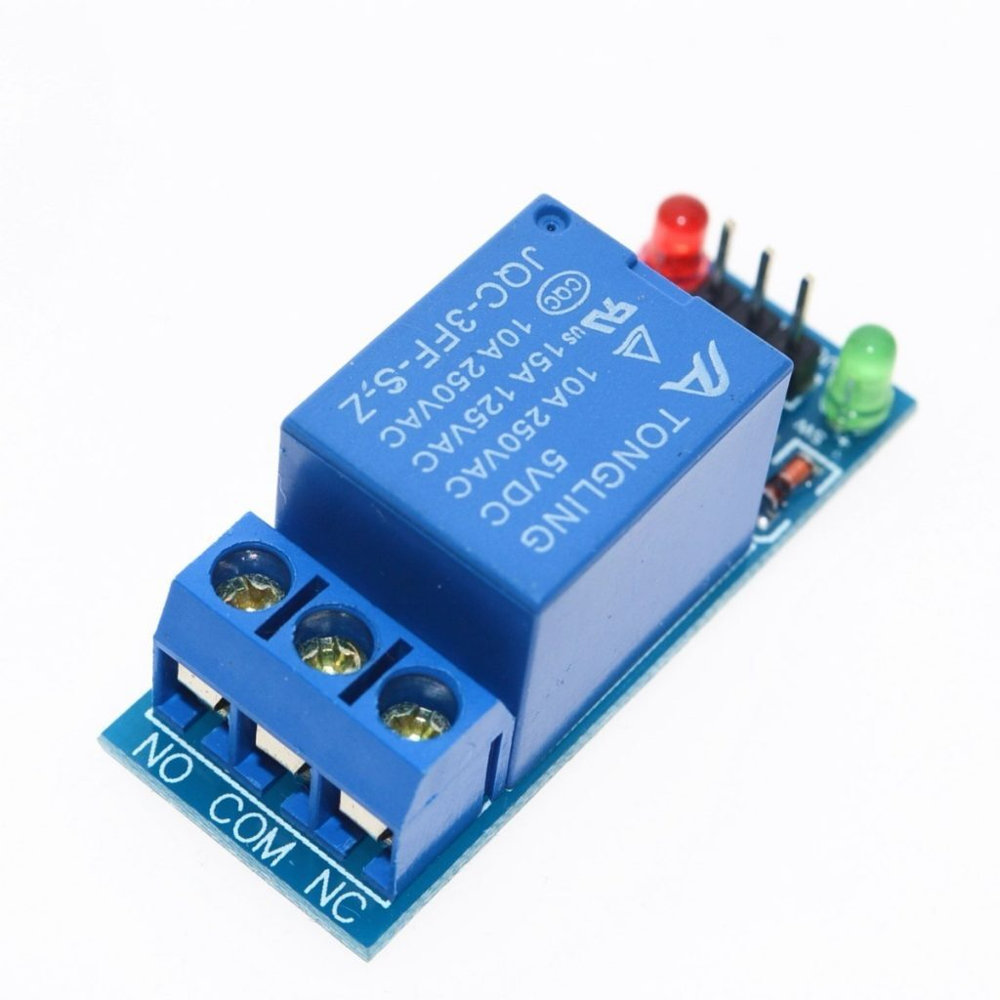|1|$19,00 MXN|
|10|Ventilador| Ventilador de bajo consumo. |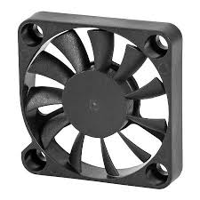|1|$16,87|
|11|Placa de pruebas sin soldadura| Placa de pruebas sin soldadura MB-102 400/830 puntos de conexión, placa de desarrollo de prueba PCB blanca/transparente, bricolaje para prototipos de escudo Arduino|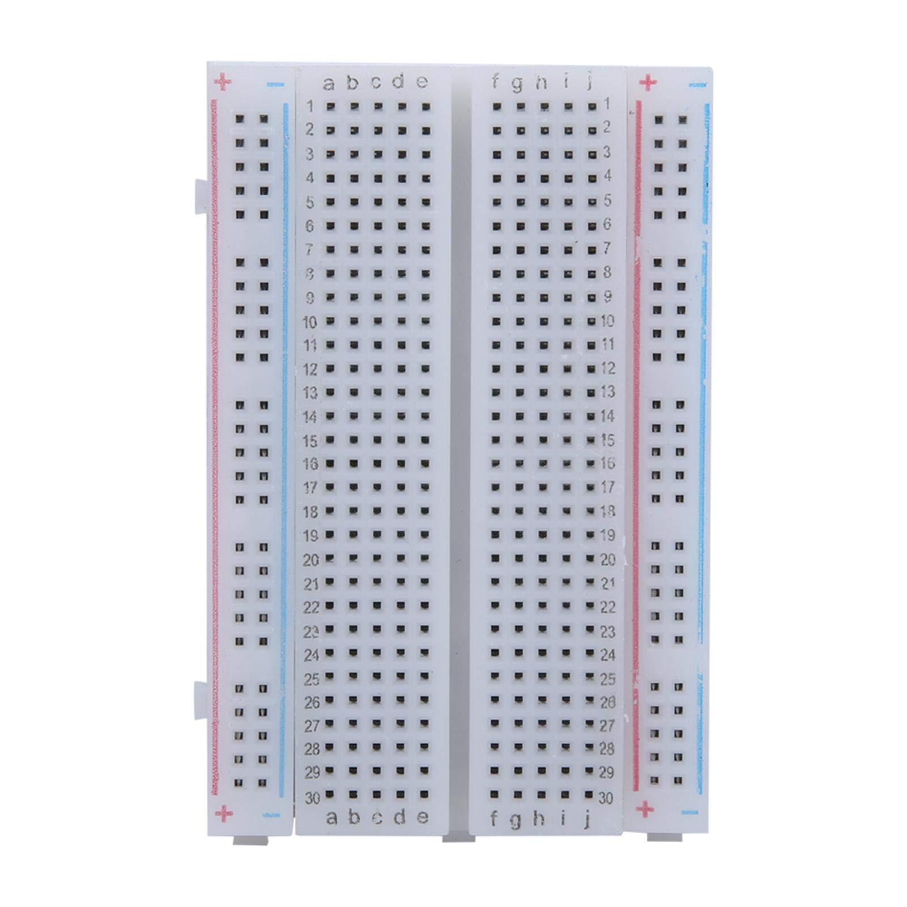|1|$68,86 MXN|
|12|Cautin| Soldador inteligente Original FM01 T65, equipo de soldadura PD, máquina de estación eléctrica, herramientas de reparación de Cautín, puntas FM65|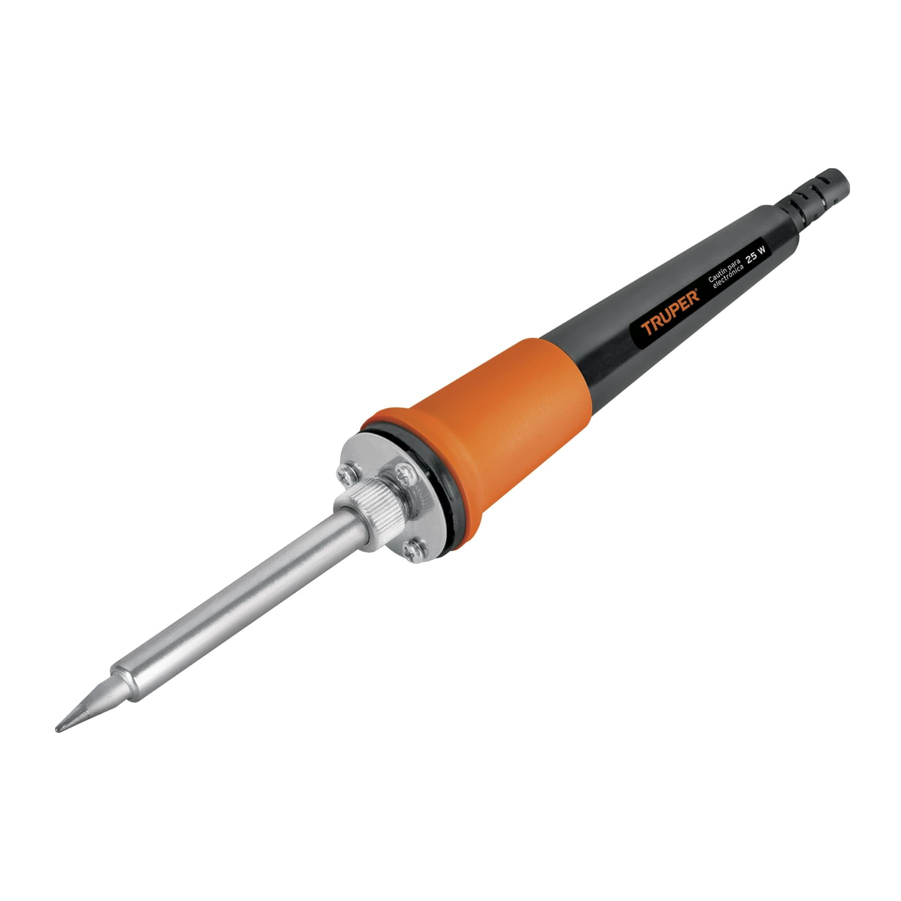|1|$68,86 MXN|
|13|Cables | Cable de puente de cobre, Conector de línea Flexible sin soldadura de pruebas para placa Arduino DIY, 10cm, 20cm, 30cm, macho, hembra, 24AWG | 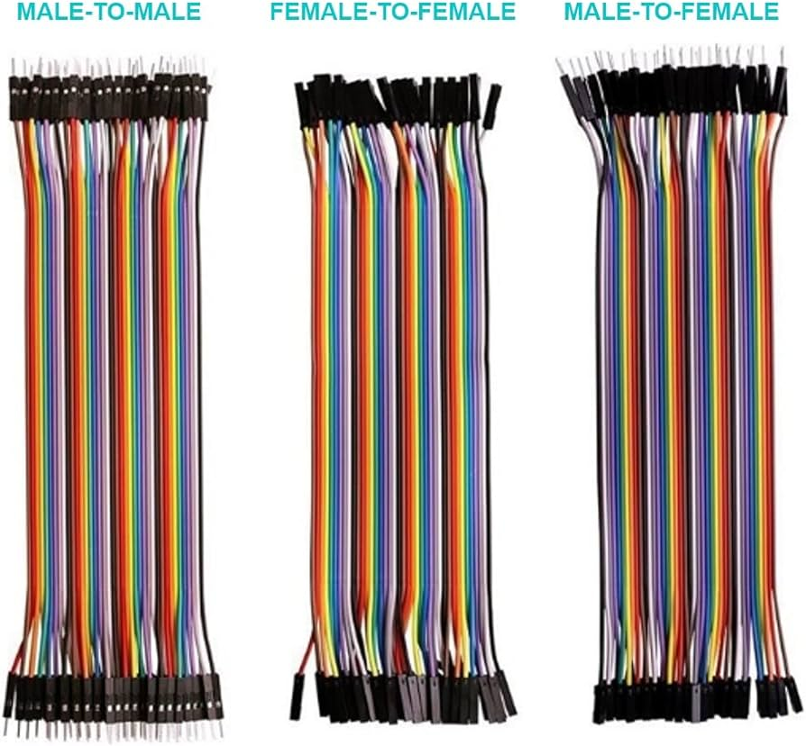|30|$56,61 MXN|

## Epicas del proyecto (Minimo debe de haber una épica por integrante de equipo)
- Monitorear las condiciones ambientales de una habitación: Esta épica se enfoca en el monitoreo de las condiciones ambientales de la habitación, como temperatura, nivel de metano y oscuridad. El objetivo es medir estos factores, evaluarlos y almacenarlos. Además, la información se recopilará y se visualizará en forma de resumen.

- Control de calidad del ambiente: Esta épica se enfoca en el control del ambiente utilizando un relevador, un ventilador, una bocina y un módulo DFPlayer. El objetivo es influir en el ambiente con los dispositivos implementados; los componentes se pueden activar a través de la aplicación de Flutter.

- Almacenamiento y analsis de datos: Esta épica se enfoca en el almacenamiento y análisis de la información recopilada en tiempo real por medio de los sensores. El objetivo es enviar los datos medidos por los sensores a una base de datos y permitir su análisis para presentarlos en forma de resumen al usuario.

## Tabla de historias de usuario
| Id | Historia de usuario | Prioridad | Estimación | Como probarlo | Responsable |
|----|---------------------|-----------|------------|---------------|-------------|
|  1  | Como usuario quiero que se monitorice en tiempo real la temperatura del ambiente para tener información más fiel a la realidad.| 1 | 3 Dias | Se obtiene información fiel en tiempo real através del sensor.| Osmar Israel Villegas Martínez |            |
|  2  | Como usuario quiero que se monitorice en tiempo real el gas en el ambiente para tener información más fiel a la realidad.| 1 | 3 Dias | Se obtiene información fiel en tiempo real através del sensor.| Osmar Israel Villegas Martínez |
|  3  | Como usuario quiero que se monitorice en tiempo real la luz de mi cuarto para obtener información más fiel a la realidad.| 1 | 3 Dias | Se obtiene información fiel en tiempo real através del sensor.| Osmar Israel Villegas Martínez |
|  4  | Como usuario quiero que se monitorice en tiempo real el clima en mi cuarto para obtener información más fiel a la realidad.| 1 | 3 Dias | Se obtiene información fiel en tiempo real através del sensor.| Victor Andrés Garay Montes |
|  5  | Como usuario quiero que se monitorice los pasos que realizo para obtener información más fiel a la realidad.| 1 | 3 Dias | Se obtiene información fiel en tiempo real através del sensor.| Victor Andrés Garay Montes  |
|  6  | Como usuario quiero una interfaz grafica para poder interactuar con la información obtenida facilmente. | 2 | 1 Semana | Se puede visualizar las graficas sin problemas desde un dispositivo movil, no existen errores graficos. | Jose Armando Gutierrez|
|  7  | Como usuario quiero tener un resumen de la información importante facilmente.| 2 | 2 Semanas | Se da un resumen fiel a la información obtenida, no tiene errores graficos y es accesible desde un télefono movil. | Jose Armando Gutierrez |
|  8  | Como desarrollador quiero que la información se almacene en una base de datos que permita un facil y rapido acceso para facilitar su manejo. | 2 | 5 Dias | Se puede almacenar y acceder a la información para realizar el resumen y generar las graficas sin problemas desde cualquier dispositivo. | Jose Armanado Gutierrez Rodriguez |
|  9  | Como usuario quiero obtener la información atravez de un dispositivo wearable.| 2 | 1 Semana |Se da un resumen fiel a la información obtenida, no tiene errores graficos y es accesible desde un wearable.| Victor Andrés Garay Montes |
|  10  | Como usuario quiero que el dispositivo sea comodo de usar para que no me moleste al llevarlo.| 3 | 1 Semana |El dispositivo que usa el usuario es comodo.| Victor Andrés Garay Montes |
|  11 | Como usuario quiero poder reproducir musica por medio de la aplicación.| 3 | 1 Semana |El dispositivo responde rapidamente y reproduce musica correctamente.| Osmar Israel Villegas Martínez |
|  12 | Como usuario quiero poder activar el ventilador por medio de la aplicación.| 3 | 1 Semana |El dispositivo responde rapidamente y enciende por tiempo prolongado el ventilador correctamente.| Osmar Israel Villegas Martínez |
|  13 | El dispositivo de sobremesa cuenta con una carcasa.| 3 | 1 Semana |El dispositivo cuenta con una carcasa funcional.| Osmar Israel Villegas Martínez/Jose Armanado Gutierrez Rodriguez |

## Tablero Kanban
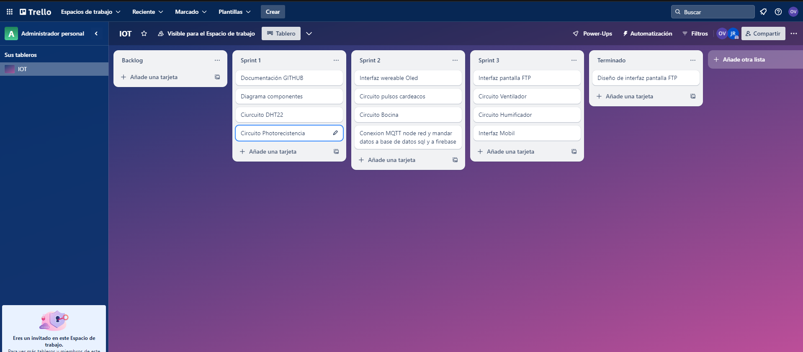

## Prototipo en dibujo
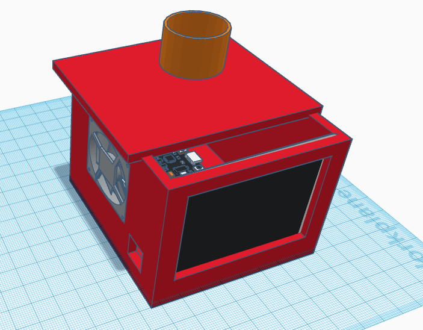

## Codigo

## Fritzing
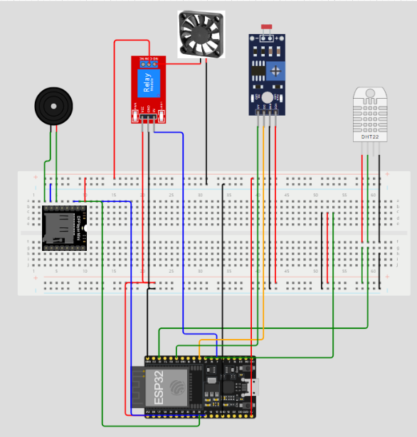

## Pantallas Flutter

## Video demostracion

## Carta de agradecimiento

## Evidencias fotograficas

